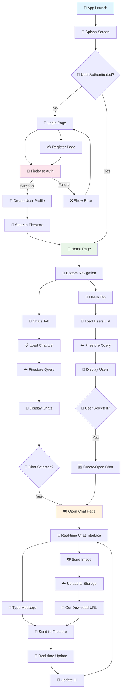

# 💬 Chatify - Flutter Firebase Chat Application

A modern, real-time chat application built with Flutter and Firebase that provides seamless messaging experience with user authentication, media sharing, and live chat functionality.

## 📱 Features

- ✅ User Authentication (Login/Register)
- ✅ Real-time Messaging
- ✅ Image Sharing
- ✅ User Profile Management
- ✅ Online Status Tracking
- ✅ Chat History
- ✅ Responsive UI Design
- ✅ Dark/Light Theme Support

## 🏗️ Project Architecture

### **MVVM Pattern with Provider State Management**

```
┌─────────────────┐    ┌─────────────────┐    ┌─────────────────┐
│     View        │◄──►│   ViewModel     │◄──►│     Model       │
│   (Pages/UI)    │    │  (Providers)    │    │ (Services/Data) │
└─────────────────┘    └─────────────────┘    └─────────────────┘
```

## 📂 Project Structure

```
lib/
├── 🏠 main.dart                    # Application entry point
├── 📄 firebase_options.dart        # Firebase configuration
│
├── 📁 models/                      # Data Models
│   ├── 👤 chat_user.dart          # User data model
│   ├── 💬 chat_message.dart       # Message data model
│   └── 🗣️ chat.dart               # Chat conversation model
│
├── 📁 pages/                       # UI Screens
│   ├── 🌟 splash_page.dart        # App loading screen
│   ├── 🔐 login_page.dart         # User login interface
│   ├── ✍️ register_page.dart      # User registration interface
│   ├── 🏡 home_page.dart          # Main navigation hub
│   ├── 💬 chats_page.dart         # Chat conversations list
│   ├── 🗨️ chat_page.dart          # Individual chat interface
│   └── 👥 users_page.dart         # Available users list
│
├── 📁 providers/                   # State Management (MVVM)
│   ├── 🔑 authentication_provider.dart    # Auth state management
│   ├── 💬 chats_page_provider.dart       # Chats list state
│   ├── 🗨️ chat_page_provider.dart        # Individual chat state
│   └── 👥 users_page_provider.dart       # Users list state
│
├── 📁 services/                    # Business Logic & APIs
│   ├── 🗄️ database_service.dart   # Firestore operations
│   ├── ☁️ cloud_storage_service.dart     # Firebase Storage
│   ├── 📱 media_service.dart      # Image/Media handling
│   └── 🧭 navigation_service.dart # Route management
│
├── 📁 widgets/                     # Reusable UI Components
│   ├── 📝 custom_input_fields.dart       # Input components
│   ├── 📋 custom_list_view_tiles.dart    # List item components
│   ├── 💭 message_bubbles.dart    # Chat message UI
│   ├── 🔘 rounded_button.dart     # Button components
│   ├── 🖼️ rounded_image.dart      # Image components
│   └── 📊 top_bar.dart            # App bar component
│
└── 📁 utils/                       # Helper Functions
    └── 🔍 firebase_api_health_check.dart # API status checker
```

## 🔧 Core Components

### 🔑 Authentication System
- **Provider**: `AuthenticationProvider`
- **Features**: Login, Registration, Session Management
- **Backend**: Firebase Authentication

### 💬 Chat System
- **Provider**: `ChatPageProvider`
- **Features**: Real-time messaging, Message history
- **Backend**: Cloud Firestore

### 👥 User Management
- **Provider**: `UsersPageProvider`
- **Features**: User discovery, Profile management
- **Backend**: Firestore + Firebase Storage

### 📱 Media Handling
- **Service**: `MediaService`
- **Features**: Image picking, Upload/Download
- **Backend**: Firebase Cloud Storage

## 🚀 Workflow Chart



## 📊 Detailed Component Workflow

### 1. 🔐 Authentication Flow
```
User Input → Validation → Firebase Auth → User Profile Creation → Database Storage → Navigation
```

### 2. 💬 Chat Creation Flow
```
Select User → Check Existing Chat → Create New/Open Existing → Real-time Listener → UI Update
```

### 3. 📤 Message Sending Flow
```
Compose Message → Validate Content → Upload Media (if any) → Store in Firestore → Real-time Broadcast
```

### 4. 📥 Message Receiving Flow
```
Firestore Listener → Data Parsing → UI State Update → Message Display → Read Status Update
```

## 🛠️ Technologies Used

### Frontend
- **Flutter** - Cross-platform UI framework
- **Dart** - Programming language
- **Provider** - State management
- **Material Design** - UI/UX framework

### Backend & Services
- **Firebase Authentication** - User management
- **Cloud Firestore** - Real-time database
- **Firebase Storage** - Media file storage
- **Firebase Analytics** - User analytics

### Additional Packages
- `get_it` - Dependency injection
- `file_picker` - Media file selection
- `flutter_spinkit` - Loading animations
- `timeago` - Relative time formatting
- `flutter_keyboard_visibility` - Keyboard detection

## 📱 App Flow Description

### 🌟 **Splash Screen**
- App initialization
- Firebase configuration
- Authentication state check
- Route to appropriate screen

### 🔐 **Authentication Pages**
- **Login**: Email/password validation, Firebase auth
- **Register**: User data collection, profile creation
- **Error handling**: Input validation, network errors

### 🏡 **Home Page**
- Bottom navigation setup
- Tab management (Chats, Users)
- Real-time data synchronization
- User status updates

### 💬 **Chats Page**
- Chat conversations list
- Last message preview
- Unread message indicators
- Pull-to-refresh functionality

### 👥 **Users Page**
- Available users discovery
- User search functionality
- Online status indicators
- Chat initiation

### 🗨️ **Chat Page**
- Real-time messaging interface
- Message type handling (text/image)
- Media upload/download
- Message status indicators
- Keyboard management

## 🔧 Setup Instructions

### Prerequisites
- Flutter SDK (>=2.12.0)
- Firebase project setup
- Android Studio / VS Code

### Installation Steps

1. **Clone the repository**
```bash
git clone <repository-url>
cd Chatify - Flutter Firebase Chat Application
```

2. **Install dependencies**
```bash
flutter pub get
```

3. **Firebase Setup**
- Create Firebase project
- Add Android/iOS apps
- Download config files:
  - `google-services.json` → `android/app/`
  - `GoogleService-Info.plist` → `ios/Runner/`

4. **Enable Firebase services**
- Authentication (Email/Password)
- Cloud Firestore
- Firebase Storage

5. **Run the application**
```bash
flutter run
```

## 🚀 Build & Deploy

### Debug Build
```bash
flutter run
```

### Release Build
```bash
flutter build apk --release
flutter build ios --release
```

### Install on Device
```bash
flutter install
```

## 🔒 Security Features

- **Authentication**: Secure Firebase Auth
- **Data Validation**: Input sanitization
- **Privacy**: User data protection
- **Storage Rules**: Firestore security rules

## 📈 Performance Optimizations

- **Lazy Loading**: Efficient data fetching
- **Image Caching**: Optimized media loading
- **Real-time Updates**: Efficient listeners
- **Memory Management**: Proper disposal

## 🎨 UI/UX Features

- **Responsive Design**: Adaptive layouts
- **Theme Support**: Light/dark modes
- **Animations**: Smooth transitions
- **Accessibility**: Screen reader support

## 🤝 Contributing

1. Fork the repository
2. Create feature branch (`git checkout -b feature/AmazingFeature`)
3. Commit changes (`git commit -m 'Add AmazingFeature'`)
4. Push to branch (`git push origin feature/AmazingFeature`)
5. Open Pull Request

## 📄 License

This project is licensed under the MIT License - see the [LICENSE](LICENSE) file for details.

## 👨‍💻 Developer

**Nitish** - Flutter Developer

## 🙏 Acknowledgments

- Flutter team for the amazing framework
- Firebase for backend services
- Material Design for UI guidelines
- Open source community for packages

---

*Built with ❤️ using Flutter & Firebase*
