# 📊 Chatify - Detailed Workflow Diagram

## 🔄 Complete Application Flow Chart

```mermaid
flowchart TD
    %% App Initialization
    START([🚀 App Launch]) --> SPLASH[🌟 Splash Screen<br/>• Initialize Firebase<br/>• Check Dependencies<br/>• Load Configuration]
    
    SPLASH --> AUTH_CHECK{🔐 Check Authentication<br/>State}
    
    %% Authentication Flow
    AUTH_CHECK -->|❌ Not Authenticated| LOGIN[📝 Login Page<br/>• Email Input<br/>• Password Input<br/>• Validation]
    AUTH_CHECK -->|✅ Authenticated| HOME[🏡 Home Page<br/>• Load User Data<br/>• Initialize Navigation<br/>• Set Online Status]
    
    LOGIN --> REGISTER_OPTION{📋 New User?}
    REGISTER_OPTION -->|Yes| REGISTER[✍️ Register Page<br/>• Email Input<br/>• Password Input<br/>• Name Input<br/>• Profile Image]
    REGISTER_OPTION -->|No| LOGIN_SUBMIT[🔑 Submit Login]
    
    REGISTER --> REG_VALIDATION[✅ Validate Registration<br/>• Email Format<br/>• Password Strength<br/>• Required Fields]
    REG_VALIDATION -->|❌ Invalid| REG_ERROR[❌ Show Registration Error]
    REG_ERROR --> REGISTER
    
    REG_VALIDATION -->|✅ Valid| FIREBASE_REG[☁️ Firebase Registration<br/>• Create Auth Account<br/>• Upload Profile Image<br/>• Store User Data]
    
    LOGIN_SUBMIT --> LOGIN_VALIDATION[✅ Validate Login<br/>• Email Format<br/>• Password Present]
    LOGIN_VALIDATION -->|❌ Invalid| LOGIN_ERROR[❌ Show Login Error]
    LOGIN_ERROR --> LOGIN
    
    LOGIN_VALIDATION -->|✅ Valid| FIREBASE_LOGIN[🔑 Firebase Authentication<br/>• Verify Credentials<br/>• Get User Token]
    
    FIREBASE_REG -->|❌ Failed| REG_ERROR
    FIREBASE_REG -->|✅ Success| CREATE_PROFILE[👤 Create User Profile<br/>• Store in Firestore<br/>• Set Initial Status<br/>• Upload Profile Image]
    
    FIREBASE_LOGIN -->|❌ Failed| LOGIN_ERROR
    FIREBASE_LOGIN -->|✅ Success| LOAD_PROFILE[👤 Load User Profile<br/>• Get User Data<br/>• Update Last Active<br/>• Set Online Status]
    
    CREATE_PROFILE --> HOME
    LOAD_PROFILE --> HOME
    
    %% Main Navigation
    HOME --> NAV_BAR[📱 Bottom Navigation<br/>• Chats Tab<br/>• Users Tab<br/>• Profile Management]
    
    NAV_BAR --> CHATS_TAB[💬 Chats Tab Selected]
    NAV_BAR --> USERS_TAB[👥 Users Tab Selected]
    
    %% Chats Flow
    CHATS_TAB --> LOAD_CHATS[📋 Load Chat List<br/>• Query Firestore<br/>• Get User's Chats<br/>• Order by Last Message]
    
    LOAD_CHATS --> CHATS_LISTENER[👂 Real-time Listener<br/>• Monitor Chat Changes<br/>• Update UI Automatically<br/>• Handle New Messages]
    
    CHATS_LISTENER --> DISPLAY_CHATS[📄 Display Chat List<br/>• Chat Participant Name<br/>• Last Message Preview<br/>• Timestamp<br/>• Unread Count]
    
    DISPLAY_CHATS --> CHAT_SELECTION{📱 Chat Selected?}
    CHAT_SELECTION -->|No| DISPLAY_CHATS
    CHAT_SELECTION -->|Yes| OPEN_CHAT[🗨️ Open Chat Page<br/>• Load Chat History<br/>• Setup Real-time Listener<br/>• Initialize Input Field]
    
    %% Users Flow
    USERS_TAB --> LOAD_USERS[👥 Load Users List<br/>• Query All Users<br/>• Exclude Current User<br/>• Get Online Status]
    
    LOAD_USERS --> USERS_LISTENER[👂 Real-time User Listener<br/>• Monitor User Status<br/>• Update Online/Offline<br/>• Update Last Active]
    
    USERS_LISTENER --> DISPLAY_USERS[📄 Display Users List<br/>• User Name<br/>• Profile Image<br/>• Online Status<br/>• Last Active Time]
    
    DISPLAY_USERS --> USER_SELECTION{👤 User Selected?}
    USER_SELECTION -->|No| DISPLAY_USERS
    USER_SELECTION -->|Yes| CHECK_CHAT[🔍 Check Existing Chat<br/>• Query Firestore<br/>• Look for Chat with User<br/>• Get or Create Chat ID]
    
    CHECK_CHAT --> OPEN_CHAT
    
    %% Chat Page Flow
    OPEN_CHAT --> CHAT_INTERFACE[💭 Chat Interface<br/>• Message History<br/>• Input Field<br/>• Send Button<br/>• Media Button]
    
    CHAT_INTERFACE --> MESSAGE_INPUT{📝 User Action?}
    
    MESSAGE_INPUT -->|📝 Type Text| TEXT_MESSAGE[✍️ Text Message<br/>• Validate Input<br/>• Check Length<br/>• Prepare for Send]
    
    MESSAGE_INPUT -->|📷 Select Image| IMAGE_PICKER[🖼️ Image Selection<br/>• Open File Picker<br/>• Validate Image<br/>• Compress if Needed]
    
    IMAGE_PICKER --> IMAGE_UPLOAD[☁️ Upload Image<br/>• Firebase Storage<br/>• Generate Download URL<br/>• Show Upload Progress]
    
    IMAGE_UPLOAD -->|❌ Failed| IMAGE_ERROR[❌ Upload Error<br/>• Show Error Message<br/>• Retry Option]
    IMAGE_ERROR --> IMAGE_PICKER
    
    IMAGE_UPLOAD -->|✅ Success| IMAGE_MESSAGE[🖼️ Image Message<br/>• Create Message Object<br/>• Include Image URL<br/>• Prepare for Send]
    
    TEXT_MESSAGE --> SEND_MESSAGE[📤 Send Message<br/>• Create Message Object<br/>• Add Timestamp<br/>• Add Sender ID]
    IMAGE_MESSAGE --> SEND_MESSAGE
    
    SEND_MESSAGE --> FIRESTORE_SEND[💾 Store in Firestore<br/>• Add to Messages Collection<br/>• Update Chat Document<br/>• Update Last Message]
    
    FIRESTORE_SEND -->|❌ Failed| SEND_ERROR[❌ Send Error<br/>• Show Error Message<br/>• Retry Option]
    SEND_ERROR --> CHAT_INTERFACE
    
    FIRESTORE_SEND -->|✅ Success| UPDATE_UI[🔄 Update Chat UI<br/>• Add Message to List<br/>• Scroll to Bottom<br/>• Clear Input Field]
    
    UPDATE_UI --> REALTIME_UPDATE[📡 Real-time Broadcast<br/>• Notify Other User<br/>• Update Chat Lists<br/>• Send Push Notification]
    
    REALTIME_UPDATE --> CHAT_INTERFACE
    
    %% Message Receiving Flow
    CHATS_LISTENER -.->|New Message| RECEIVE_MESSAGE[📥 Receive Message<br/>• Parse Message Data<br/>• Identify Sender<br/>• Check Message Type]
    
    RECEIVE_MESSAGE --> UPDATE_CHAT_LIST[🔄 Update Chat List<br/>• Move Chat to Top<br/>• Update Last Message<br/>• Increment Unread Count]
    
    RECEIVE_MESSAGE --> UPDATE_ACTIVE_CHAT{🗨️ Chat Currently Open?}
    UPDATE_ACTIVE_CHAT -->|Yes| ADD_MESSAGE_UI[➕ Add Message to UI<br/>• Display Message<br/>• Mark as Read<br/>• Scroll to Bottom]
    UPDATE_ACTIVE_CHAT -->|No| NOTIFICATION[🔔 Show Notification<br/>• Display Message Preview<br/>• Play Sound<br/>• Badge Update]
    
    %% Logout Flow
    HOME --> LOGOUT_OPTION[⚙️ Settings/Logout]
    LOGOUT_OPTION --> LOGOUT_CONFIRM{❓ Confirm Logout?}
    LOGOUT_CONFIRM -->|No| HOME
    LOGOUT_CONFIRM -->|Yes| FIREBASE_LOGOUT[🚪 Firebase Logout<br/>• Clear Auth Token<br/>• Update Offline Status<br/>• Clear Local Data]
    
    FIREBASE_LOGOUT --> LOGIN
    
    %% Styling
    classDef startEnd fill:#e1f5fe,stroke:#01579b,stroke-width:2px,color:#000
    classDef authFlow fill:#fce4ec,stroke:#ad1457,stroke-width:2px,color:#000
    classDef mainFlow fill:#e8f5e8,stroke:#2e7d32,stroke-width:2px,color:#000
    classDef chatFlow fill:#fff3e0,stroke:#ef6c00,stroke-width:2px,color:#000
    classDef dataFlow fill:#f3e5f5,stroke:#7b1fa2,stroke-width:2px,color:#000
    classDef errorFlow fill:#ffebee,stroke:#c62828,stroke-width:2px,color:#000
    
    class START,SPLASH startEnd
    class LOGIN,REGISTER,FIREBASE_LOGIN,FIREBASE_REG,LOGIN_VALIDATION,REG_VALIDATION,CREATE_PROFILE,LOAD_PROFILE authFlow
    class HOME,NAV_BAR,CHATS_TAB,USERS_TAB mainFlow
    class OPEN_CHAT,CHAT_INTERFACE,SEND_MESSAGE,TEXT_MESSAGE,IMAGE_MESSAGE,RECEIVE_MESSAGE chatFlow
    class FIRESTORE_SEND,LOAD_CHATS,LOAD_USERS,UPDATE_UI,REALTIME_UPDATE dataFlow
    class LOGIN_ERROR,REG_ERROR,SEND_ERROR,IMAGE_ERROR errorFlow
```



## 📋 Workflow Components Explanation

### 🚀 **1. Application Startup Flow**

| Step | Component | Description |
|------|-----------|-------------|
| 1 | App Launch | Initialize Flutter app, load main.dart |
| 2 | Splash Screen | Firebase initialization, dependency injection setup |
| 3 | Auth Check | Verify if user is logged in using Firebase Auth |
| 4 | Route Decision | Navigate to Home (authenticated) or Login (not authenticated) |

### 🔐 **2. Authentication Flow**

| Step | Component | Description |
|------|-----------|-------------|
| 1 | Login Page | Email/password input with validation |
| 2 | Registration | New user signup with profile creation |
| 3 | Firebase Auth | Server-side authentication verification |
| 4 | Profile Creation | Store user data in Firestore database |
| 5 | Session Management | Maintain authentication state across app sessions |

### 🏡 **3. Main Navigation Flow**

| Step | Component | Description |
|------|-----------|-------------|
| 1 | Home Page | Central hub with bottom navigation |
| 2 | Tab Management | Switch between Chats and Users tabs |
| 3 | Real-time Setup | Initialize Firestore listeners |
| 4 | Status Update | Set user online status and last active time |

### 💬 **4. Chat Management Flow**

| Step | Component | Description |
|------|-----------|-------------|
| 1 | Chat List | Display existing conversations |
| 2 | Chat Selection | Open specific conversation |
| 3 | Message History | Load previous messages from Firestore |
| 4 | Real-time Listener | Monitor new messages in real-time |
| 5 | UI Updates | Dynamically update chat interface |

### 📤 **5. Message Sending Flow**

| Step | Component | Description |
|------|-----------|-------------|
| 1 | Input Processing | Handle text input or media selection |
| 2 | Validation | Check message content and format |
| 3 | Media Upload | Upload images to Firebase Storage (if applicable) |
| 4 | Message Creation | Create message object with metadata |
| 5 | Firestore Storage | Store message in database |
| 6 | Real-time Broadcast | Notify recipients of new message |

### 📥 **6. Message Receiving Flow**

| Step | Component | Description |
|------|-----------|-------------|
| 1 | Listener Trigger | Firestore listener detects new message |
| 2 | Data Parsing | Extract message data and sender information |
| 3 | UI Update | Add message to chat interface |
| 4 | Notification | Show notification if chat not active |
| 5 | Read Status | Mark message as read and update status |

### 👥 **7. User Discovery Flow**

| Step | Component | Description |
|------|-----------|-------------|
| 1 | Users List | Display all registered users |
| 2 | Status Monitoring | Show online/offline status |
| 3 | User Selection | Select user to start chat |
| 4 | Chat Creation | Create new conversation or open existing |
| 5 | Navigation | Redirect to chat interface |

### 🔄 **8. Real-time Synchronization**

| Component | Function | Update Frequency |
|-----------|----------|------------------|
| Chat Messages | Instant message delivery | Real-time |
| User Status | Online/offline indicators | Every 30 seconds |
| Last Active | User last seen timestamp | On activity |
| Chat List | Conversation order updates | Real-time |
| Unread Count | Message badges | Real-time |

### 📱 **9. State Management Flow**

```
User Action → Provider Method → Service Call → Firestore Operation → State Update → UI Refresh
```

### 🔒 **10. Security & Validation Flow**

| Layer | Validation | Security Measure |
|-------|------------|------------------|
| Input | Client-side validation | Format checking, length limits |
| Authentication | Firebase Auth | JWT token verification |
| Database | Firestore Rules | User permission checks |
| Storage | Firebase Storage Rules | File access controls |
| Network | HTTPS/SSL | Encrypted data transmission |

## 🎯 Key Integration Points

### **Firebase Services Integration**
- **Authentication**: User login/logout management
- **Firestore**: Real-time database operations
- **Storage**: Media file upload/download
- **Analytics**: User behavior tracking

### **Provider Pattern Implementation**
- **AuthenticationProvider**: Manages user session state
- **ChatsPageProvider**: Handles chat list operations
- **ChatPageProvider**: Manages individual chat interactions
- **UsersPageProvider**: Controls user discovery features

### **Service Layer Architecture**
- **DatabaseService**: Firestore CRUD operations
- **MediaService**: File handling and media processing
- **NavigationService**: Route management and navigation
- **CloudStorageService**: Firebase Storage operations

---

*This workflow ensures a seamless, real-time chat experience with proper state management and error handling at every step.*